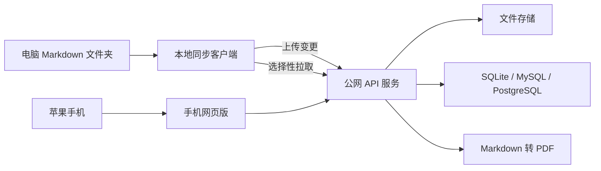

# Md-PDF

多系统之间同步 MD/PDF 文件，可手机端在线阅览。

## 当前状态

当前版本是本地试验版 Markdown 阅读程序，用来先验证手机端网页阅读 PDF 的体验：

- 启动时输入 Markdown 文件夹路径
- 自动扫描并监听 `.md` 文件变化
- 在本机启动一个手机可访问的阅读页面
- 首页按文件夹浏览 Markdown，点击文件夹可进入下一级
- 点击文件后由本机 Edge/Chrome 生成 PDF，适合 iPhone 阅读

后续目标是演进为“电脑本地同步客户端 + 公网服务端 + 手机网页版阅读”的同步阅读系统。手机端只使用网页，不开发 iOS App。

## 目标架构

推荐采用三部分：

- 本地同步客户端：运行在电脑上，监听一个 Markdown 文件夹，检测新增、修改、删除后上传到服务器。
- 公网服务端：保存 Markdown 文件、版本、用户权限和设备同步状态，并负责生成 PDF。
- 手机网页版：iPhone 通过 Safari 等浏览器访问，只查看文件列表、搜索和阅读 PDF，不编辑 Markdown。
- 同步根目录：用户在电脑上指定一个根目录，服务端按相对路径保存文件和目录，目录层级需要与本地完全一致。



## 技术选型

- 语言：TypeScript，方便客户端、服务端和共享协议共用类型。
- 服务端：Node.js + Fastify 或 Express，提供认证、同步 API、文件列表、版本接口和 PDF 接口。
- 数据库：MVP 先用 SQLite，后续公网多人使用可切 MySQL 或 PostgreSQL。
- 本地客户端：先做 Node.js CLI，使用 `chokidar` 监听文件夹；稳定后再打包成 Windows 程序。
- 本地状态：MVP 可用 JSON 文件保存同步状态，后续再换 SQLite。
- 手机端：只做移动网页，iPhone Safari 可直接打开文件列表和 PDF。
- PDF：服务端用 Playwright/Chromium 将 Markdown 渲染成排版稳定的 PDF，并按版本缓存。

## MVP 功能拆分

- 用户登录和 token 认证，避免公网文件被别人访问。
- 本地客户端配置服务器地址、token 和监听目录。
- 客户端首次启动从服务器获取文件树，让用户选择要拉取的文件或文件夹。
- 客户端把选中的文件和目录树下载到本地目录，并记录订阅路径。
- 客户端监听 `.md` 文件变更，上传文件内容、相对路径、更新时间和 hash。
- 服务端保存 Markdown 原文、hash、版本号和更新时间。
- 客户端定时拉取已订阅文件的服务端版本，发现更新后写回本地。
- 发生冲突时先保留 `.conflict.md` 副本，不直接覆盖。
- 手机端登录后显示所有 Markdown 文件列表，不需要订阅到本地。
- 手机端点击文件时打开对应 PDF；如果 Markdown 更新过，服务端重新生成 PDF。

## 手机端阅读策略

手机端只使用网页版，不直接阅读 Markdown 源码：

- 手机端提供登录、文件列表、搜索、PDF 打开和下载。
- Markdown 同步到服务器后，服务端记录该文件的版本号。
- 手机请求 PDF 时，服务端检查缓存；如果当前版本已经生成过 PDF，直接返回缓存。
- 如果 Markdown 有新版本，服务端先渲染 Markdown，再用浏览器引擎导出 PDF。
- PDF 页面样式统一控制字体、行距、代码块、表格和图片，让手机阅读体验接近“打开文档阅读”。

## 同步策略

MVP 采用客户端主导的双向同步：

- 同步范围以用户指定的本地根目录为基准，所有文件和目录都使用相对路径表示。
- 本地根目录下新增目录时，agent 需要把目录结构同步到服务端，服务端文件树与本地保持一致。
- 某台电脑打开 CLI 后，先从服务器拉取已订阅的文件树，按相对路径在本机创建目录并写入文件。
- 首次拉取完成后，agent 记录每个文件的最后同步 hash/version，然后再开启本地文件监听，避免初始化下载被误判为本地新增。
- 本地修改：文件监听触发，防抖后计算 hash，hash 变化才上传。
- 服务端修改：客户端定时拉取已订阅路径的版本列表，版本更新后下载。
- 新电脑：登录后只拉文件树，用户选择要同步的文件或文件夹。
- 未订阅文件：只存在服务端，不下载到本机。
- 冲突判断：比较本地 hash、最后同步 hash 和服务端版本，发现双方都改过时创建 `.conflict.md` 副本。

## 计划项目结构

后续从当前本地试验版演进为 monorepo：

```text
apps/
  server/   认证、文件存储、版本记录、同步 API 和 PDF 生成
  mobile/   手机网页版，只读文件列表和 PDF 阅读入口
  agent/    本地同步客户端，负责监听、上传、拉取和冲突保护
packages/
  shared/   同步协议、类型定义、hash 工具和路径工具
```

## 实施顺序

1. 搭建 monorepo 和基础 TypeScript 工程。
2. 实现服务端认证、文件上传、列表、下载、删除和版本 API。
3. 实现本地客户端初始化配置和首次文件列表拉取。
4. 实现选择部分文件或文件夹下载到本地。
5. 实现文件监听，保存 `.md` 后自动上传。
6. 实现已订阅文件的定时拉取和本地写回。
7. 实现服务端 Markdown 转 PDF 和 PDF 缓存。
8. 实现苹果手机网页端只读文件列表和 PDF 打开/下载。
9. 实现基础冲突保护和客户端打包。

## 使用

```powershell
npm install
npm run dev
```

本地监听端默认会监控当前用户桌面目录，并使用端口 `50002`。服务器端默认使用端口 `50001`。

也可以直接指定目录和端口：

```powershell
npm run dev -- --dir "C:\Users\wenxiang\Desktop" --port 50002
```

启动后，电脑浏览器或 iPhone Safari 打开程序输出的地址即可。

如果手机和电脑在同一个 Wi-Fi，优先用类似 `http://192.168.x.x:3333` 的地址。

首页会按目录显示文件夹和当前目录下的 Markdown 文件。点击文件夹进入下一级，进入子目录后可以点“返回上级”回到上一层。

### 图片资源目录

Markdown 引用的本地图片统一放在监控根目录下的 `asset` 目录中，程序会监听这个目录内图片的新增、修改和删除。

推荐结构：

```text
文章.md
asset\demo.png
asset\2026\example.jpg
```

Markdown 中使用相对路径引用：

```markdown


```

不建议引用监控根目录外的图片绝对路径，因为不同电脑上的 Typora 本地路径通常不一致。

### 选择性同步和删除

启动时会让用户选择要同步/监听的 Markdown 文件或文件夹。后续只有选中范围内的文件变更会进入同步流程。

也可以用参数直接选择全部文件，跳过交互：

```powershell
npm run dev -- --dir "C:\Users\wenxiang\Desktop" --sync all
```

手机网页支持“选择文件”后批量删除。删除会先在服务端生成删除记录；其他电脑下次启动同步程序时，如果本地存在相同相对路径的文件，会移动到 `.md-local-reader\trash`，本地没有则忽略。

电脑本地删除已选择同步范围内的 Markdown 文件时，也会生成删除记录，供其他电脑启动时处理。

## 双击启动

可以直接双击：

```text
release\local-md-reader.cmd
```

它会打开命令行窗口，并默认监听当前用户桌面目录。

## PDF 说明

程序会调用本机已安装的 Microsoft Edge 或 Chrome 的 headless print 功能生成 PDF。

如果自动找不到浏览器，可以设置环境变量：

```powershell
$env:BROWSER_PATH = "C:\Program Files (x86)\Microsoft\Edge\Application\msedge.exe"
npm run dev
```

### 使用 Typora 主题导出 PDF

如果希望 PDF 尽量沿用 Typora 的自定义主题，可以把主题 CSS 路径传给程序：

```powershell
npm run dev -- --dir "C:\Users\wenxiang\Desktop" --theme-css "C:\Users\wenxiang\AppData\Roaming\Typora\themes\github.css"
```

也可以使用环境变量：

```powershell
$env:TYPORA_THEME_CSS = "C:\Users\wenxiang\AppData\Roaming\Typora\themes\github.css"
npm run dev
```

macOS 常见主题目录类似：

```bash
TYPORA_THEME_CSS="$HOME/Library/Application Support/abnerworks.Typora/themes/github.css" npm run dev -- --dir "$HOME/Documents"
```

程序仍然使用本机 Edge/Chrome 的 headless print 生成 PDF，只是在生成 HTML 时注入 Typora 主题 CSS。主题 CSS 内容会参与 PDF 缓存 key，修改主题后会重新生成 PDF。
